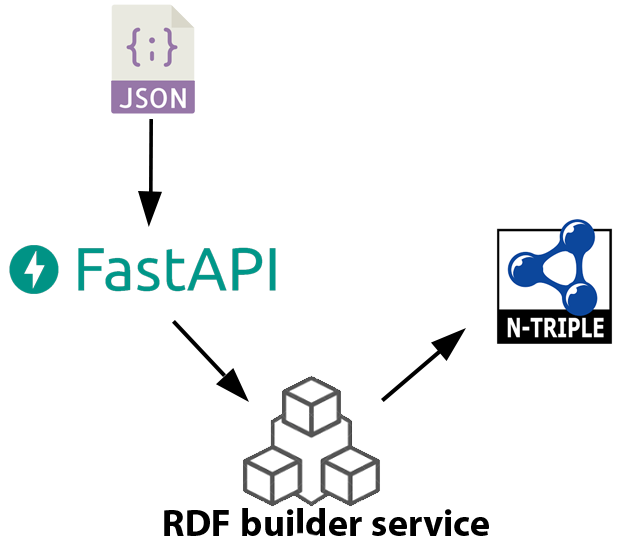

# CRUD-RDF-data

This repository contains a simple CRUD (Create, Read, Update, Delete) application for managing RDF (Resource Description Framework) data. 

## Table of Contents
- [Introduction](#introduction)
- [Technologies Used](#technologies-used)
- [Features](#features)
- [Setup Instructions](#setup-instructions)
- [Usage](#usage)
- [Contributing](#contributing)
- [License](#license)

## Introduction
RDF is a standard for representing and exchanging data on the web. This application provides a user-friendly interface for managing RDF data using CRUD operations. It allows users to create new data, read existing data, update existing data, and delete unwanted data.

## Technologies Used
- Python
- FastAPI
- Nameko
- Docker

## Features
1. Create new RDF data by specifying the subject, predicate, and object.
2. Read existing RDF data by searching for specific subjects or predicates.
3. Update existing RDF data by selecting the desired triple and modifying its values.
4. Delete unwanted RDF data by selecting the desired triple and deleting it.

## Setup Instructions
1. Clone this repository to your local machine using `git clone https://github.com/hesamdavarpanah/CRUD-RDF-data.git`
2. Make sure you have Python installed.
3. Run the Project with this command on your terminal:
```console
root@user:~$ docker compose up
running...
```

## Usage
1. Upon running the application, you will be presented with a user-friendly interface where you can perform CRUD operations on RDF data.
2. To create new RDF data, click on the "Create" tab and enter the subject, predicate, and object values. Then click on the "Add" button.
3. To read existing RDF data, click on the "Read" tab and enter a search term in the search bar. The application will display all triples that match your search term.
4. To update existing RDF data, click on the "Update" tab and select the desired triple from the table. Then modify its values and click on the "Update" button.
5. To delete unwanted RDF data, click on the "Delete" tab and select the desired triple from the table. Then click on the "Delete" button.

## Contributing
Contributions are welcome! If you have any suggestions or find any bugs, please feel free to open an issue or submit a pull request.

## License
This project is licensed under the [MIT License](https://github.com/hesamdavarpanah/CRUD-RDF-data/blob/main/LICENSE).


